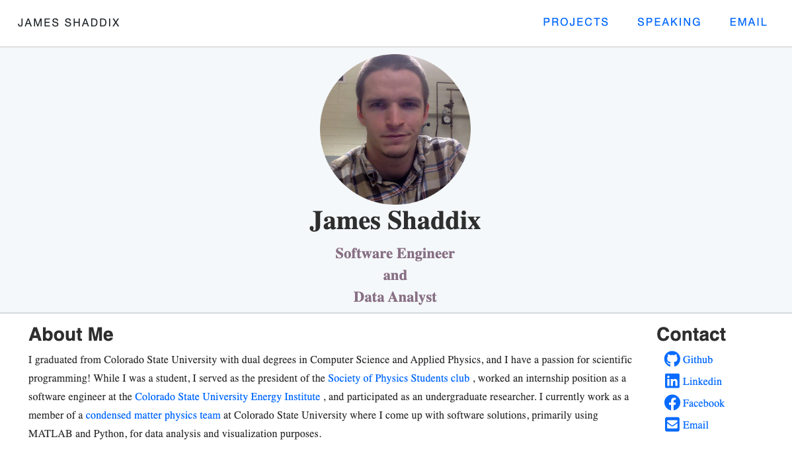

# Personal Website
This is a personal website I built to show off some my projects. The website
uses Bootstrap for the frontend and Python's flask framework for the backend
with Jinja2 templating. This is a fairely simple website that has a navigation bar with links 
to web pages for displaying my projects, some talks I have given, and a contact
page. The project is hosted on an AWS Lightsail instance that I configured using an nginx 
web server, with the gunicorn application server.

* This website can be found at [jshaddix.com](http://jshaddix.com)



## Dependencies
* python3.7.4
* Third party python libraries listed in **requirements.txt**

## Installation Instructions

1. Clone the repo
```Bash
git clone https://github.com/Jim-Shaddix/Personal-Website.git
```
2. You can than use the following command to download all the third party libraries
needed to run this program.
```Bash
pip install -r requirements.txt
```
3. Run the application!
```Bash
python app.py
```
* If you would like to use this application, you should configure the mail
  settings that are found in the `Config.py` file. By default, the mail settings
  contain arbitrary values (because I am not interested in giving out my email password).

## Citations
* Some of the CSS styling I used for the banner and the navigation bar was based on this [webpage](https://www.ybrikman.com/).
    - (this webpage comes from an open source repository).
    
* I was able to build the form for the contact page by following this
[guide](https://code.tutsplus.com/tutorials/intro-to-flask-adding-a-contact-page--net-28982).
This guide is slightly outdated for modern versions of the FlaskWTF library but it is not to hard to fill in the blanks.

* I was able to configure my own SSL encrypted nginx webserver using the gunicorn application server
on AWS Lightsail by following [Corey Schafer's flask deployment tutorial](https://www.youtube.com/watch?v=goToXTC96Co&list=PL-osiE80TeTs4UjLw5MM6OjgkjFeUxCYH&index=13).
