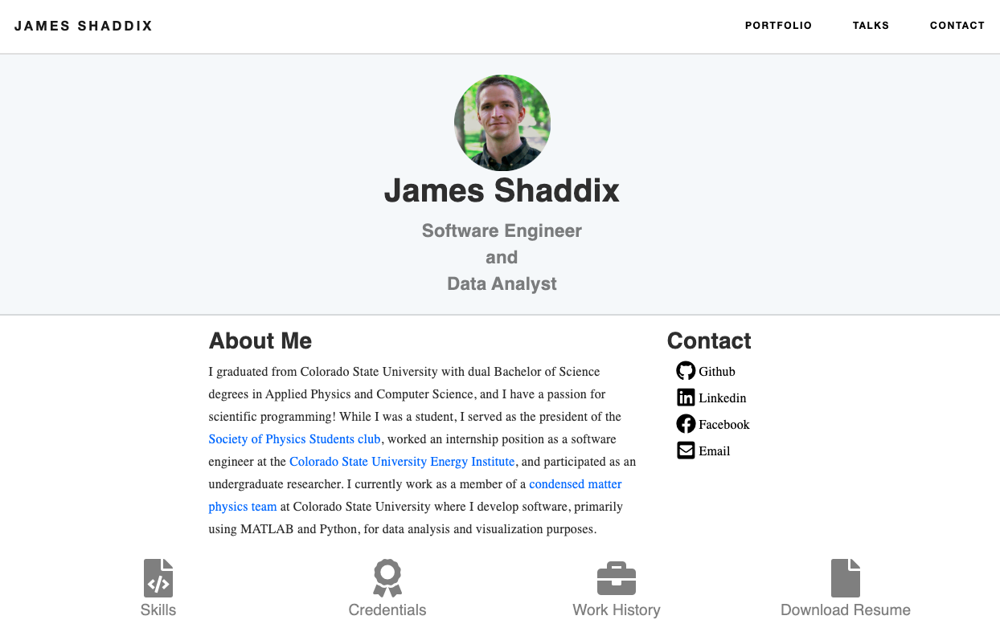

# Personal Website
This is a personal website I built to show off some my projects. The website
uses Bootstrap for the frontend and Python's flask framework for the backend
with Jinja2 templating. This is a fairely simple website that has a naviagation bar with links 
to webpages for displaying my projects, some talks I have given, and a contact
page.



### NOTE:
This project is still in development

## Dependencies
* python3.7
* Third party python libraries listed in **requirements.txt**

## Installation Instructions

1. Clone the repo
```Bash
git clone https://github.com/Jim-Shaddix/Personal-Website.git
```
2. You can than use the following command to download all the third party libraries
needed to run this program.
```Bash
pip install -r requirements.txt
```
3. Run the application!
```Bash
python app.py
```

## Citations
* Some of the CSS styling I used was based on this [webpage](https://www.ybrikman.com/)
    - (this webpage comes from an open source repository).
    
* I was able to build the form for the contact page by following this
[guide](https://code.tutsplus.com/tutorials/intro-to-flask-adding-a-contact-page--net-28982).
